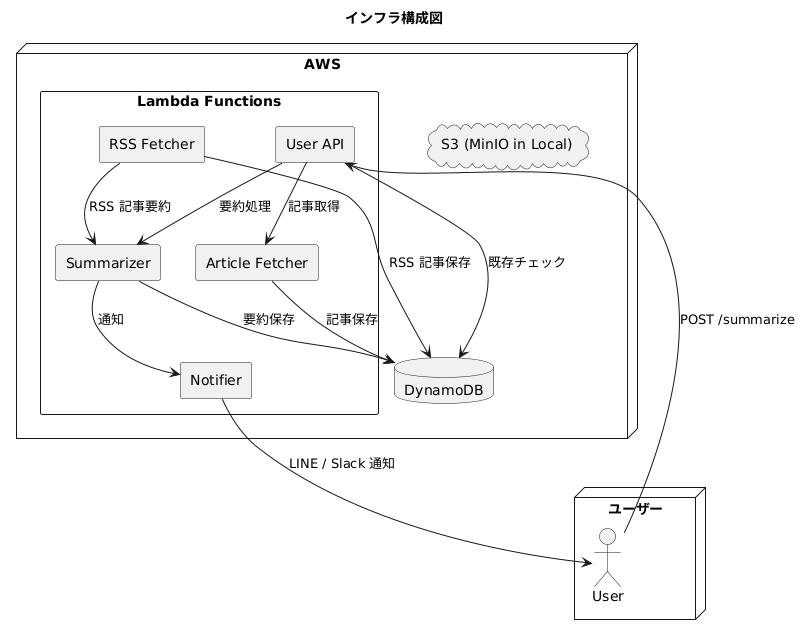
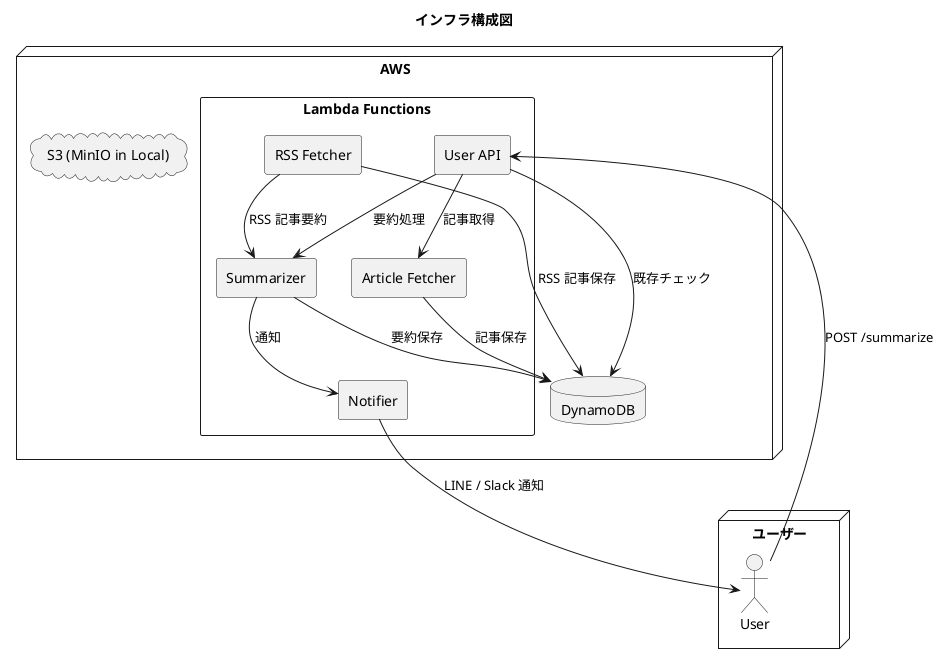
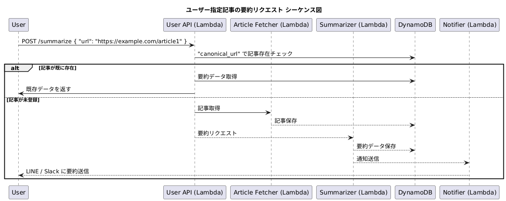
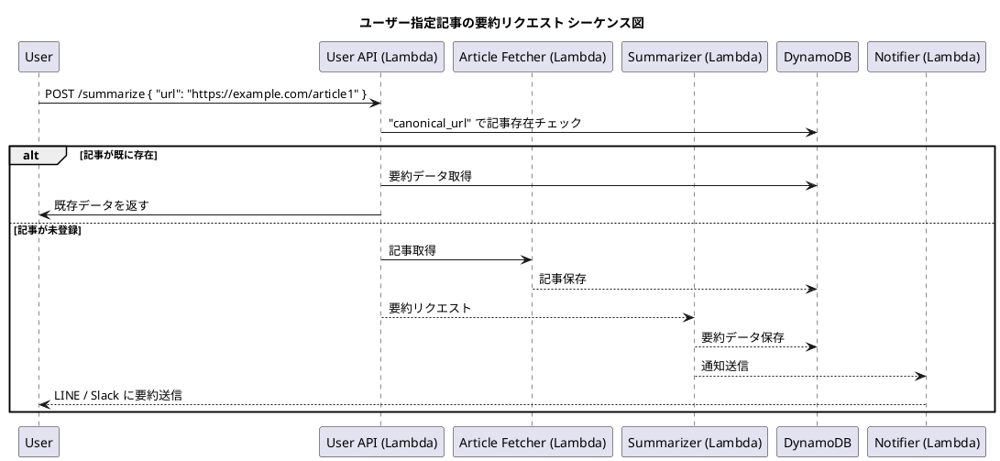

# 設計ドキュメント

## 1. サービス概要

### 目的・課題解決
- RSS フィードから最新の技術情報を取得し、自動的に要約・分類する。
- 生成 AI を活用して、英語・日本語の技術情報をタグ付けし、ユーザーが手軽に情報を得られるようにする。
- 要約した情報をユーザーに通知する。
- ユーザーが手動で記事を送信し、要約をリクエストできる機能を提供する。

### 想定ユーザー
- エンジニア
- 初期段階では開発者自身が利用

### 主要機能
- RSS から最新の技術情報を取得
- 生成 AI によるタグ付けと要約
- ユーザーが手動で要約リクエストを送信可能
- ユーザーへの通知（LINE, Slack）

## 2. アーキテクチャ

記事「[私のよく使うソフトウェアアーキテクチャの雛型](https://zenn.dev/m10maeda/articles/my-favorite-architecture-blueprint)」を参考に、以下の4層構造を採用。

- **プレゼンテーション層**: ソフトウェアの入出力を担当
- **アプリケーション層**: ソフトウェアのユースケースを担当
- **ドメイン層**: ビジネスのルールや制約、プロセスを担当
- **インフラストラクチャー層**: 技術的関心ごとの全般を担当

### 技術スタック
- **フロントエンド:** TypeScript, React, Next.js（将来的な追加）
- **バックエンド:** Golang
- **生成 AI:** DeepSeek API
- **インフラ:** AWS CDK v2 (TypeScript)
- **データベース:** NoSQL（DynamoDB）

### クラウドサービス
- AWS（無料枠を最大限活用）

### デプロイ
- サーバーレスアーキテクチャを優先
- AWS CDK v2 を使用し、インフラをコード管理 (IaC)
- フロントエンドは Next.js の静的サイトを S3 + CloudFront でホスティング（将来的な追加）

## 3. インフラ構成図

UML

## 4. シーケンス図

UML

## 5. データベース設計

### ✅ `articles` テーブル（要約記事を保存）

| Partition Key (`article_id`: UUIDv7) | URL | Title | Summary | Tags            | Created At   |
|--------------------------------------|-------------------------------|-------------------------------|----------------|----------------|----------------------|----------------|
| `01HV3XYZ...`                        | `https://example.com/article1` | "AIの未来"       | "要約結果..."     | `["ai", "tech"]`     | `2025-03-15`   |

- `article_id`: UUIDv7 による一意キー（時系列ソート可能）
- `canonical_url`, `original_url`: GSI で検索可能に設定

---

### ✅ `users` テーブル（ユーザー管理）

| Partition Key (`user_id`: UUIDv7) | External ID | Plan     | Requests Limit | Used Requests | Last Reset   |
|----------------------------------|-------------|----------|----------------|----------------|--------------|
| `01HV4ABC...`                    | `line-123`  | `free`   | `5`            | `3`            | `2025-03-15` |
| `01HV4DEF...`                    | `slack-456` | `premium`| `100`          | `10`           | `2025-03-15` |

- `external_id`: LINEやSlackのユーザーID（自然キー）

---

### ✅ `tags` テーブル（タグ情報）

| Partition Key (`tag_name`) | Created At   |
|----------------------------|--------------|
| `ai`                       | `2025-03-10` |
| `cloud`                    | `2025-03-10` |

- タグ名は小文字・半角・記号正規化された状態で保存
- **タグ名の一意性**によりサロゲートキーは不要

---

#### 🔧 タグ名の標準化ルール

- すべてのタグは以下のルールで正規化して保存する：
  - 小文字に変換（例: `AI` → `ai`）
  - 前後の空白を除去（例: ` DevOps ` → `devops`）
  - 全角英数字は半角へ変換（例: `ＡＩ` → `ai`）
  - 特殊文字は置換（例: `C++` → `c-plus-plus`）

---

### ✅ `article_tags` テーブル（タグと記事の関連 + スコア）

| Partition Key (`tag_name`) | Sort Key (`article_id`) | Score |
| -------------------------- | ----------------------- | ----- |
| `ai`                       | `article_abc123`        | 0.92  |
| `cloud`                    | `article_abc123`        | 0.80  |
| `security`                 | `article_def456`        | 0.75  |

---

- タグごとの関連スコアを記録することで、精度の高い検索・推薦・分析が可能になります。
- 多対多のリレーション用中間テーブル
- `tag_name` に GSI を設定して、タグから記事の検索も可能に

---

## 6. 監視・運用
- **記事取得時のエラー（403, 404, タイムアウト）を CloudWatch Logs に記録**
- **要約処理の実行時間を CloudWatch Metrics で監視**
- **DynamoDB のスループットを監視し、負荷がかかりすぎないように調整**

## 7. まとめ
✅ **Canonical URL を優先して重複チェック**（ない場合は `original_url` を代用）  
✅ **最初のリリースでは Embedding を使わず、拡張しやすいテーブル設計にする**  
✅ **将来的にレコメンドや類似検索を追加できる形で設計**  
✅ **監視・エラーハンドリングを考慮し、運用コストを抑える**  

